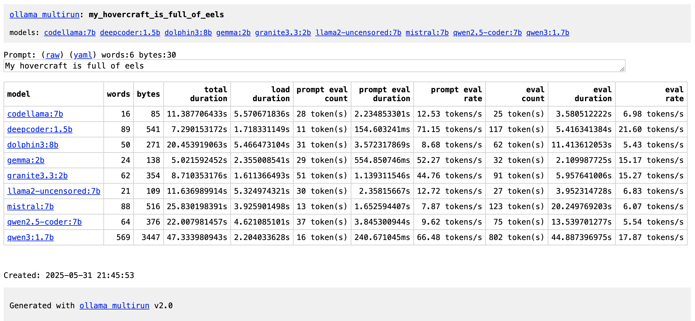
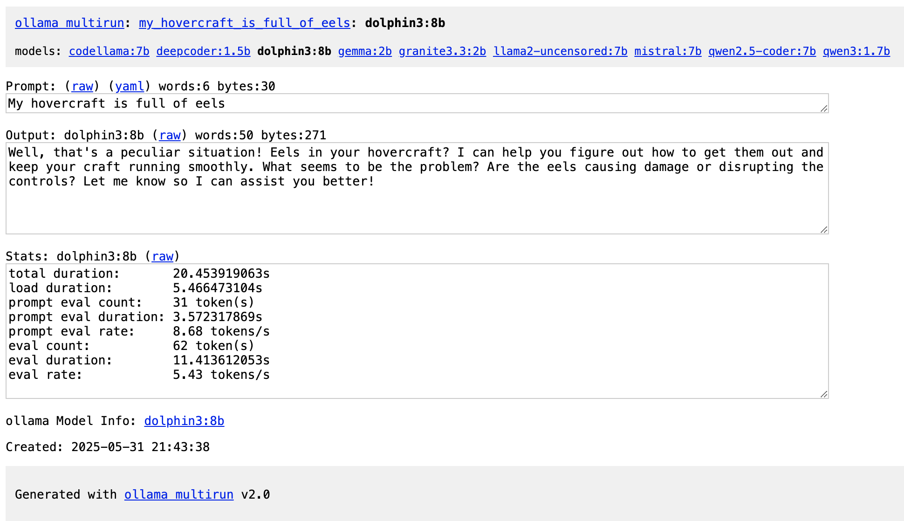
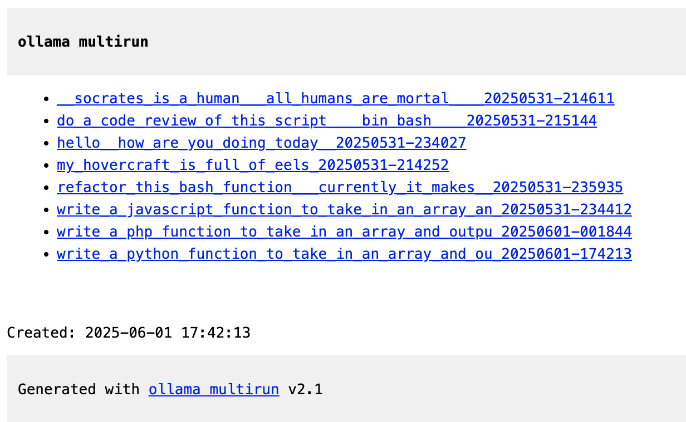

# ollama multirun

A bash shell script to run a single prompt against *all* your locally installed ollama models,
saving the output and performance statistics as easily navigable web pages. 

Useful for comparing model responses, tracking performance
and documenting your local AI experiments

Demo: https://attogram.github.io/ai_test_zone/

Repo: https://github.com/attogram/ollama-multirun


Run results:


Model page:


Index page:


## ✨ Features

* **Batch Processing:** Run a single prompt across all models listed by `ollama list`.
* **Comprehensive HTML Reports:** Generates a full web-based report for each run, including:
    * An index page summarizing all model outputs and key statistics.
    * Dedicated pages for each model's output with raw text and stats.
    * Links for easy navigation between models and runs.
* **Detailed Statistics:** Captures and displays `ollama --verbose` output, including:
    * Total duration
    * Load duration
    * Prompt evaluation count, duration, and rate
    * Generation evaluation count, duration, and rate
* **Prompt Persistence:** Saves the original prompt as a plain text file (`prompt.txt`) and in GitHub's prompt YAML format (`.prompt.yaml`) for easy re-use and documentation.
* **Clean Slate:** Automatically clears and stops Ollama models between runs for consistent results.
* **Flexible Prompt Input:**
    * Manual entry via the command line.
    * From a file (e.g., `multirun.sh < prompt.txt`).
    * From a pipe (e.g., `echo "my prompt" | multirun.sh`).
* **Safe Naming:** Generates sanitized, timestamped directories for each run to keep your results organized.

## 🚀 Getting Started

### Prerequisites

Before running `ollama multirun`, ensure you have the following installed:

* **[ollama](https://ollama.com/):** The core large language model runner.
* **bash:** The default shell on most Linux and macOS systems.
* **`expect`:** For interacting with Ollama's `run` command (`sudo apt-get install expect` on Debian/Ubuntu, `brew install expect` on macOS).
* **Standard Unix Utilities:** `awk`, `sed`, `tr`, `wc` (typically pre-installed).

### Installation

1.  **Clone the Repository:**
    ```bash
    git clone https://github.com/attogram/ollama-multirun.git
    cd ollama-multirun
    ```

    or just copy the latest version from: https://raw.githubusercontent.com/attogram/ollama-multirun/refs/heads/main/multirun.sh
    
3.  **Make Executable:**
    ```bash
    chmod +x multirun.sh
    ```
4.  **Pull Some Ollama Models:** If you don't have any models yet, you'll need to download them:
    ```bash
    ollama pull llama2
    ollama pull mistral
    ollama pull phi3
    # etc.
    ```

## 💡 Usage

Run the script from your terminal. The results will be saved in a new directory inside the `results/` folder.

1.  **Enter prompt manually (default):**
    ```bash
    ./multirun.sh
    ```
    *The script will prompt you to enter your text. Press `Enter` and then `Ctrl+D` (on Linux/macOS) or `Ctrl+Z` then `Enter` (on Windows Bash/WSL) to finish input.*

2.  **Enter prompt from a file:**
    ```bash
    ./multirun.sh < my_prompt.txt
    ```

3.  **Enter prompt from a pipe:**
    ```bash
    echo "Your prompt here" | ./multirun.sh
    ```
    ```bash
    echo "Summarize this document: $(cat document.txt)" | ./multirun.sh
    ```

### After Running

Once the script finishes, it will print the path to your newly created results directory (e.g., `results/your_prompt_tag_20240101-123456/`).

Navigate to this directory and open `index.html` in your web browser to view the generated report:

```bash
xdg-open results/your_prompt_tag_20240101-123456/index.html # Linux
open results/your_prompt_tag_20240101-123456/index.html     # macOS
# For Windows, manually navigate to the file in File Explorer and open with browser.
```

## 📂 Results Structure
```
ollama-multirun/
├── multirun.sh             # The main script
└── results/                # Directory where all output runs are stored
    ├── index.html          # Global index of all past runs
    └── your_prompt_tag_YYYYMMDD-HHMMSS/ # A directory for each specific run
        ├── index.html      # HTML summary page for this run
        ├── prompt.txt      # The raw prompt used
        ├── prompt_tag.prompt.yaml # Prompt in GitHub YAML format
        ├── model1.html     # HTML page for model1's output and stats
        ├── model1.txt      # Raw text output from model1
        ├── model1.stats.txt# Raw stats from model1
        ├── model2.html     # ... and so on for each model
        └── ...
```

## 🛠️ Development & Contribution

We welcome contributions! Whether it's a bug report, a feature suggestion, or a code change, your input is valuable.
 * Fork the repository.
 * Clone your forked repository: ```git clone https://github.com/YOUR_USERNAME/ollama-multirun.git```
 * ```cd ollama-multirun```
 * Create a new branch: ```git checkout -b feature/your-feature-name```
 * Make your changes.
 * Test your changes thoroughly.
 * Commit your changes: ```git commit -m "feat: Add a new feature (e.g., --output-json option)"```
 * Push to your branch: ```git push origin feature/your-feature-name```
 * Open a Pull Request on the original repository, detailing your changes.

## Reporting Issues
If you encounter any bugs or have feature requests, please open an issue on the GitHub Issues page.

## 📜 License
This project is licensed under the MIT License - see the LICENSE file for details.

## 🙏 Acknowledgements
 * Ollama for making local LLMs accessible.
 * The open-source community for inspiration and tools.
