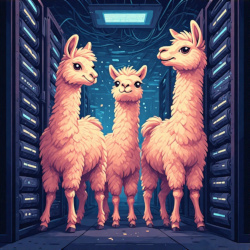
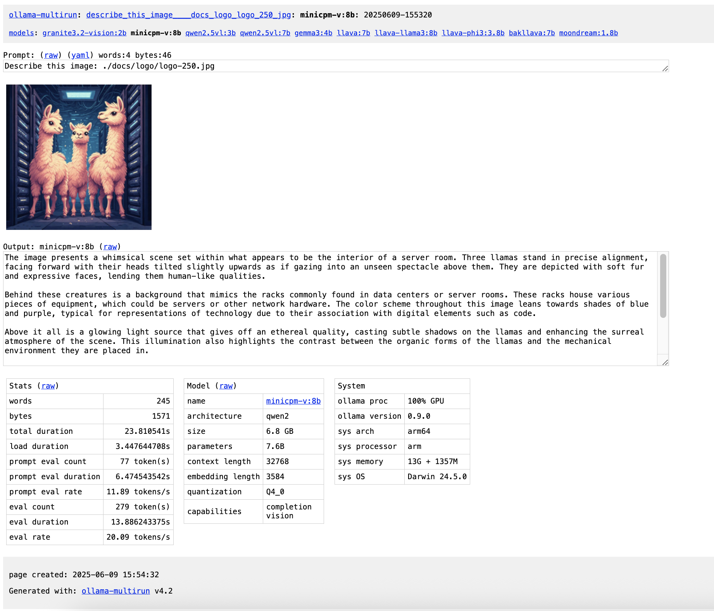

# ollama-multirun



A bash shell script to run a single prompt against any or all of your locally installed ollama models,
saving the output and performance statistics as easily navigable web pages.

Useful for comparing model responses, tracking performance
and documenting your local AI experiments

Demo: https://attogram.github.io/ai_test_zone/

Repo: https://github.com/attogram/ollama-multirun

For Help and Discussions please join the [Attogram Discord Channel](https://discord.gg/BGQJCbYVBa)

<!-- ALL-CONTRIBUTORS-BADGE:START - Do not remove or modify this section -->
[](#contributors-)
<!-- ALL-CONTRIBUTORS-BADGE:END -->

## Screenshots

### Run index page:


### Model output page:


* [View more screenshots](docs/screenshots/README.md)


## ✨ Features

* **Batch Processing:** Run a single prompt across all models listed by `ollama list`.
* **Comprehensive HTML Reports:** Generates a full web-based report for each run, including:
    * An index page summarizing all model outputs and key statistics.
    * Dedicated pages for each model's output with raw text and stats.
    * Links for easy navigation between models and runs.
* **Detailed Statistics:** Captures and displays `ollama --verbose` output, including:
    * Total duration
    * Load duration
    * Prompt evaluation count, duration, and rate
    * Generation evaluation count, duration, and rate
* **Prompt Persistence:** Saves the original prompt as a plain text file (`prompt.txt`) and in GitHub's prompt YAML format (`.prompt.yaml`) for easy re-use and documentation.
* **Clean Slate:** Automatically clears and stops Ollama models between runs for consistent results.
* **Flexible Prompt Input:**
    * Interactive prompt entry (default behavior) (e.g., `./multirun.sh`).
    * From the command line (e.g., `./multirun.sh "my prompt"`).
    * From a file (e.g., `./multirun.sh < prompt.txt`).
    * From a pipe (e.g., `echo "my prompt" | ./multirun.sh`).
* **Safe Naming:** Generates sanitized, timestamped directories for each run to keep your results organized.

## 🚀 Getting Started

### Prerequisites

Before running `ollama multirun`, ensure you have the following installed:

* **[ollama](https://ollama.com/):** The core large language model runner.
* **bash:** The default shell on most Linux and macOS systems.
* **`expect`:** For interacting with Ollama's `run` command (`sudo apt-get install expect` on Debian/Ubuntu, `brew install expect` on macOS).
* **Standard Unix Utilities:** `awk`, `sed`, `tr`, `wc` (typically pre-installed).

### Installation

1.  **Clone the Repository:**
    ```bash
    git clone https://github.com/attogram/ollama-multirun.git
    cd ollama-multirun
    ```

    or just copy the latest version from: https://raw.githubusercontent.com/attogram/ollama-multirun/refs/heads/main/multirun.sh

2.  **Make Executable:**
    ```bash
    chmod +x multirun.sh
    ```
3.  **Pull Some Ollama Models:** If you don't have any models yet, you'll need to download them:
    ```bash
    ollama pull llama2
    ollama pull mistral
    ollama pull phi3
    # etc.
    ```

## 💡 Usage

Run the script from your terminal. The results will be saved in a new directory inside the `results/` folder.

- **Enter prompt interactively (default):**
    ```bash
    ./multirun.sh
    ```

-  **Enter prompt from the command line:**
    ```bash
    ./multirun.sh "Your prompt here"
    ```
    ```bash
    ./multirun.sh "Summarize this document: $(cat document.txt)"
    ```

- **Enter prompt from a file:**
    ```bash
    ./multirun.sh < my_prompt.txt
    ```

- **Enter prompt from a pipe:**
    ```bash
    echo "Your prompt here" | ./multirun.sh
    ```
    ```bash
    echo "Summarize this document: $(cat document.txt)" | ./multirun.sh
    ```

- **Specify models to run:**
    Use the -m option, with comma-seperated list of model names (no spaces) 
    ```bash
    ./multirun.sh -m model1name,model2name
    ```

- **Include images:**
    ```bash
    ./multirun.sh "Describe this image: ./vision/image.jpg"
    ```

- **Specify response timeout:**
    Use the -t option, with timeout specified in seconds
    ```bash
    ./multirun.sh -t 60
    ```

### After Running

Once the script finishes, 
it will print the path to your newly created results directory (e.g., `results/your_prompt_tag_20250601-123456/`).

Navigate to this directory and open `index.html` in your web browser to view the generated reports

## 📂 Results Structure
```
ollama-multirun/
├── multirun.sh             # The main script
└── results/                # Directory where all output runs are stored
    ├── index.html          # Global index of all past runs
    ├── models.html         # Global index of all models, with links to past run results
    └── your_prompt_tag_YYYYMMDD-HHMMSS/ # A directory for each specific run
        ├── index.html          # HTML summary page for this run
        ├── models.html         # HTML models info summary
        ├── prompt.txt          # The raw prompt used
        ├── tag.prompt.yaml     # Prompt in GitHub YAML format
        ├── image.jpg           # If an image was included in the prompt, it will be saved here
        ├── model1.html         # HTML page for model1's output and stats
        ├── model1.output.txt   # Raw text output from model1
        ├── model1.thinking.txt # Raw thinking text output from model1 (for thinking models only)
        ├── model1.stats.txt    # Raw stats from model1
        ├── model1.info.txt     # Raw info from model1
        ├── model2.html         # ... and so on for each model
        └── ...
```

## 🛠️ Development & Contribution

We welcome contributions! Whether it's a bug report, a feature suggestion, or a code change, your input is valuable.
* Fork the repository.
* Clone your forked repository: ```git clone https://github.com/YOUR_USERNAME/ollama-multirun.git```
* ```cd ollama-multirun```
* Create a new branch: ```git checkout -b feature/your-feature-name```
* Make your changes.
* Test your changes thoroughly.
* Commit your changes: ```git commit -m "feat: Add a new feature (e.g., --output-json option)"```
* Push to your branch: ```git push origin feature/your-feature-name```
* Open a Pull Request on the original repository, detailing your changes.

## Reporting Issues
If you encounter any bugs or have feature requests, please open an issue on the GitHub Issues page.

## 📜 License
This project is licensed under the MIT License - see the LICENSE file for details.

## 🙏 Acknowledgements
* Ollama for making local LLMs accessible.
* The open-source community for inspiration and tools.

## More from the Attogram Project

| Project                                                     | About                                                                                                                                                                                           |
|-------------------------------------------------------------|-------------------------------------------------------------------------------------------------------------------------------------------------------------------------------------------------|
| [**Attogram Project<br />Discord Channel**][discord-invite] | Join the **Attogram Project Discord Channel** for:<br />- Announcements<br />- Technical Support<br />- General Chat about Attogram Projects                                                    |
| [**Ollama Multirun**][ollama-multirun]                      | Run a prompt against all, or some, of your models running on Ollama.<br />- Creates web pages with the output, performance statistics and model info.<br />- All in a single Bash shell script. |
| [**Ollama Bash Lib**][ollama-bash-lib]                      | A Bash Library to interact with Ollama                                                                                                                                                          | 
| [**Ollama Bash Toolshed**][ollama-bash-toolshed]            | Chat with tool calling models.<br />- Sample tools included.<br />- Add new tools to your shed with ease.<br />- Runs on Ollama.<br />- All via Bash shell scripts.                             |
| [**LLM Council**][llm-council]                              | Start a chat room between all, or some, of your models running on Ollama.<br />- All in a single Bash shell script.                                                                             |
| [**Small Models**][small-models]                            | Comparison of small open source LLMs<br />- 8b parameters or less                                                                                                                               |
| [**AI Test Zone**][ai_test_zone]                            | AI Testing reports<br />- hosted on https://attogram.github.io/ai_test_zone/                                                                                                                    |

[discord-invite]: <https://discord.gg/BGQJCbYVBa> "Attogram Project Discord Channel"
[ollama-multirun]: <https://github.com/attogram/ollama-multirun> "Ollama Multirun"
[ollama-bash-toolshed]: <https://github.com/attogram/ollama-bash-toolshed> "Ollama Bash Toolshed"
[llm-council]: <https://github.com/attogram/llm-council> "LLM Council"
[ollama-bash-lib]: <https://github.com/attogram/ollama-bash-lib> "Ollama Bash Lib"
[small-models]: <https://github.com/attogram/small-models> "Small Models"
[ai_test_zone]: <https://github.com/attogram/ai_test_zone> "AI Test Zone"

## Contributors ✨

Thanks goes to these wonderful people ([emoji key](https://allcontributors.org/docs/en/emoji-key)):

<!-- ALL-CONTRIBUTORS-LIST:START - Do not remove or modify this section -->
<!-- prettier-ignore-start -->
<!-- markdownlint-disable -->
<table>
  <tbody>
    <tr>
      <td align="center" valign="top" width="14.28%"><a href="https://attogram.github.io/"><br /><sub><b>Attogram Project</b></sub></a><br /><a href="https://github.com/attogram/ollama-multirun/commits?author=attogram" title="Code">💻</a></td>
      <td align="center" valign="top" width="14.28%"><a href="https://github.com/Yodo9000"><br /><sub><b>Yodo9000</b></sub></a><br /><a href="https://github.com/attogram/ollama-multirun/issues?q=author%3AYodo9000" title="Bug reports">🐛</a></td>
      <td align="center" valign="top" width="14.28%"><a href="https://ollama.com"><br /><sub><b>Ollama</b></sub></a><br /><a href="#tool-ollama" title="Tools">🔧</a></td>
      <td align="center" valign="top" width="14.28%"><a href="https://github.com/drumnix"><br /><sub><b>drumnix</b></sub></a><br /><a href="https://github.com/attogram/ollama-multirun/issues?q=author%3Adrumnix" title="Bug reports">🐛</a></td>
    </tr>
  </tbody>
</table>

<!-- markdownlint-restore -->
<!-- prettier-ignore-end -->

<!-- ALL-CONTRIBUTORS-LIST:END -->

This project follows the [all-contributors](https://github.com/all-contributors/all-contributors) specification. Contributions of any kind welcome!
